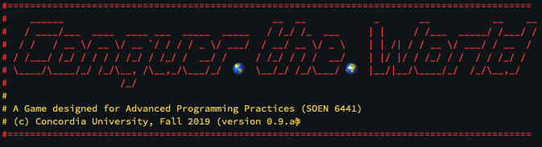

<p>
  
  <a href="https://github.com/wayoubi/RiskGame/wiki">
    
  </a>
  <a href="https://github.com/kefranabg/readme-md-generator/graphs/commit-activity">
    
  </a>
  <h1>Project for Advanced Programming Practices Course (SOEN 6411)</h1>
  <br/>
  
</p>

## How to Build and Play the Game
Make sure you have github and Java JSDK installed on your computer

See how to install git  
[here](https://git-scm.com/book/en/v2/Getting-Started-Installing-Git)

See how to install JSDK1.8  
[here](https://docs.oracle.com/javase/8/docs/technotes/guides/install/install_overview.html)

Please make sure your Java SDK (Not JRE) on the path, for example use

```sh 
$ java -version                                                                                                                                                                          ✔  10321  13:51:19
java version "1.8.0_144"
Java(TM) SE Runtime Environment (build 1.8.0_144-b01)
Java HotSpot(TM) 64-Bit Server VM (build 25.144-b01, mixed mode)
```

Download the source code from github, on your computer open new terminal

```sh 
$ git clone https://github.com/wayoubi/RiskGame.git
```
To play the game, use the play script file
On Mac and Linux (Please make sure you have the access rights to execcute the script file)

```sh
$ ./play.sh
```
On Windows

```sh
$ play.cmd
```

## Create Eclipse Project
If you want to create an eclipse project execute the following command

On Mac and Linux

```sh
$ ./mvnw eclipse:eclipse
```
On Windows

```sh
$ mvnw eclipse:eclipse
```


## Authors
Pinkal Shah

* Github: [@Pinkal-Shah](https://github.com/Pinkal-Shah)

Nasim Adabi

* Github: [@nasimadabi](https://github.com/nasimadabi)

Michael Hanna

* Github: [@HannaMichael](https://github.com/HannaMichael)

Wasim Alayoubi

* Twitter: [@w_alayoubi](https://twitter.com/w_alayoubi)
* Github: [@wayoubi](https://github.com/wayoubi)

## Show your support

Give a ⭐️ if this project helped you!
